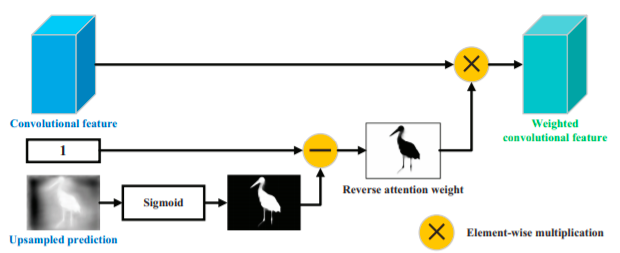
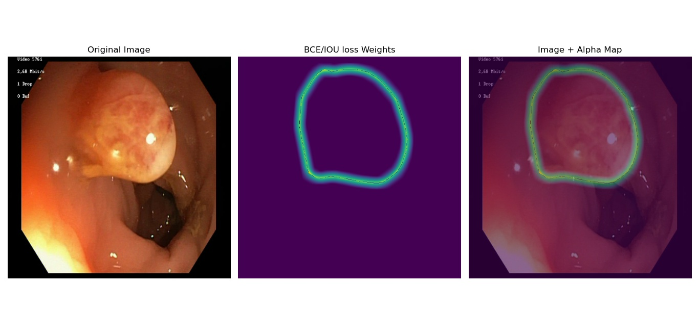

# Parallel Reverse Attention Network for Polyp Segmentation


## Paper Abstract
```
Colonoscopy is an effective technique for detecting colorectal
polyps, which are highly related to colorectal cancer. In clinical practice,
segmenting polyps from colonoscopy images is of great importance since
it provides valuable information for diagnosis and surgery. However, 
accurate polyp segmentation is a challenging task, for two major reasons:
(i) the same type of polyps has a diversity of size, color and texture; and
(ii) the boundary between a polyp and its surrounding mucosa is not
sharp. To address these challenges, we propose a parallel reverse attention
network (PraNet)for accurate polyp segmentation in colonoscopy
images. Specifically, we first aggregate the features in high-level layers
using a parallel partial decoder (PPD). Based on the combined feature,
we then generate a global map as the initial guidance area for the following components. 
In addition, we mine the boundary cues using the reverse attention (RA) module,
which is able to establish the relationship between areas and boundary cues. 
Thanks to the recurrent cooperation mechanism between areas and boundaries,
our PraNet is capable of calibrating some misaligned predictions, improving the segmentation
accuracy. Quantitative and qualitative evaluations on five challenging
datasets across six metrics show that our PraNet improves the segmentation accuracy significantly,
and presents a number of advantages in terms of generalizability, and real-time segmentation efficiency
```
:scroll: Paper link: [Parallel Reverse Attention network for Polyps Segmentation](https://arxiv.org/pdf/2006.11392v4.pdf)

## Proposed Architecture in paper

The original paper is implemented in [Pytorch](https://pytorch.org/). Here I re-implemented same paper in [Tensorflow==2.6.0](https://www.tensorflow.org/api_docs/python/tf)

### PraNet(Parallel Reverse Attention Network) consist of three main component
* Feature Extractor Backbone (here [resnet50](https://arxiv.org/pdf/1512.03385.pdf) and [Mobilenetv2](https://arxiv.org/pdf/1801.04381.pdf))
* Parallel Partial Decoder Block (Main proposal of this paper)
* Reverse Attention Block ([Reverse Attention for Salient object detection](https://arxiv.org/pdf/1807.09940.pdf))


*Proposed Architecture in paper(Image taken from paper)*

### Feature Extractor Backbone
For extracting high level features from a pretrained network, the authors of the paper has used [Res2Net50](https://arxiv.org/pdf/1904.01169.pdf) pretrained on [Imagenet](https://www.image-net.org/). A feature extractor backbone can be any SOTA pretrained Image Recognition model. I used [resnet50](https://arxiv.org/pdf/1512.03385.pdf) for high precision output and [Mobilenetv2](https://arxiv.org/pdf/1801.04381.pdf) for low latency output pretrained on [Imagenet](https://www.image-net.org/).
The ultimate goal of using a pre-trained feature extractor backbone is to extract high level features from images (<i>i.e for resnet50 {conv3_block4_out f=512, conv4_block6_out f=1024, conv5_block3_out f=2048 }</i>) and aggregate to get a global saliency map.


*Features at conv2_block3_out of resnet50 backbone*

### Parallel Partial Decoder
Most of all popular Biomedical Image Segmention model <i>like [Unet](https://arxiv.org/pdf/1505.04597.pdf) , [U-net++](https://arxiv.org/pdf/1807.10165.pdf), [ResUnet](https://arxiv.org/pdf/1904.00592.pdf) etc</i>. are full Encoder-Decoder model which aggregates all multi-level feature from backbone network. But According to [Wu et al.](https://arxiv.org/pdf/1904.08739v1.pdf) paper, <b>compared with high-level features of backbone, low-level features demand more computational resources due to their larger spatial resolutions, but contribute less to over all performance of the model.</b> Therefore, this paper introduces a PPD(Paraller Partial Decoder) block which aggregates only high-level features which is extracted from pretrained resnet50 model to get a *Global Saliency Map*. This block aggregates all high-level features with parallel connection this way the gradients can flow much faster and efficiently.


*PPD block*

### Reverse Attention block

In a clinical setting, doctors first roughly locate the polyp region, and then carefully inspect local tissues to accurately label the polyp. Our Global Saliency map is derived from the deepest CNN layer, which can only capture a relatively rough location of the polyp tissues, without structural details (see proposed Architecture figure). To address this issue, This paper proposes a principle strategy to progressively mine discriminative polyp regions through an erasing foreground object manner as given in paper [Reverse Attention for Salient object detection](https://arxiv.org/pdf/1807.09940.pdf). Instead of aggregating features from all levels like in [Unet](https://arxiv.org/pdf/1505.04597.pdf) [U-net++](https://arxiv.org/pdf/1807.10165.pdf) and [ResUnet](https://arxiv.org/pdf/1904.00592.pdf), The paper proposes to adaptively learn the reverse attention in three parallel high-level
features. In other words, our architecture can sequentially mine complementary
regions and details by erasing the existing estimated polyp regions from highlevel side-output features, where the existing estimation is up-sampled from the deeper layer. <b>(Mostly taken from PraNet Paper, do refer [paper](https://arxiv.org/pdf/2006.11392v4.pdf) to get more info)</b>



*Reverse Attention block (from paper [Reverse Attention for Salient Object Detection](https://arxiv.org/pdf/1807.09940.pdf))*

### Loss function
[PraNet](https://arxiv.org/pdf/2006.11392v4.pdf) paper uses Weighted BCE(Binary Cross Entropy loss) + Weighted IoU loss. Here I used  WBCE loss + WDice loss. Inspired by the loss function poroposed in paper [F3Net](https://vipl.ict.ac.cn/uploadfile/upload/2020071410571149.pdf). Do see the paper F3net to know more about this loss function.


*Weights for Dice and BCE loss*

## Training and Testing model

The PraNet Model was created with [Tensorflow==2.6.0](https://www.tensorflow.org/api_docs/python/tf) and was trained on [Google Colab's](https://colab.research.google.com/) Tesla T4 GPU (16GB VRAM)

### Dataset structure
Tensorflow [tf.data](https://www.tensorflow.org/guide/data) API is used to create Input Data pipeline.   
<b>In order to create a data pipeline for Image and Mask, the folder should be structured likewise:</b>
```
polyps_dataser
├── images [1000 files]
│   ├── 1.jpg
│   ├── 2.jpg
│   └── 3.jpg
└── masks [1000 files]
    ├── 1.jpg
    ├── 2.jpj
    └── 3.jpj

```

### Model settings
PraNet model was trained with two diefferent backbone architecture
1. PraNet + Resnet50 (Bigger, Accurate but high latency model)
2. PraNet + MobilenetV2 (Smaller, Low latency but little less accurate model)

### Usage
* Clone my github repo [PraNet](https://github.com/Thehunk1206/PRANet-Polyps-Segmentation)
* Run ```$pip install -r requirements.txt``` to install required python packgages.


For Training model, run following
```
$python train_pranet.py --help
usage: train_pranet.py [-h] [--data_path DATA_PATH] [--data_split DATA_SPLIT] [--epoch EPOCH] [--lr LR] [--batchsize BATCHSIZE] [--inputsize INPUTSIZE]
                       [--backbone BACKBONE] [--gclip GCLIP] [--trained_model_path TRAINED_MODEL_PATH] [--logdir LOGDIR]

optional arguments:
  -h, --help            show this help message and exit
  --data_path DATA_PATH
                        path to dataset
  --data_split DATA_SPLIT
                        split percent of val and test data
  --epoch EPOCH         epoch number
  --lr LR               learning rate
  --batchsize BATCHSIZE
                        training batch size
  --inputsize INPUTSIZE
                        input image size
  --backbone BACKBONE   Feature Extractor backbone Arc
  --gclip GCLIP         gradient clipping margin
  --trained_model_path TRAINED_MODEL_PATH
  --logdir LOGDIR       Tensorboard logs
```
#### Example 
```
!python train_pranet.py --data_path polyps_dataset/ \
                        --data_split 0.1 \
                        --epoch 25 \
                        --lr 1e-4 \
                        --batchsize 16 \
                        --inputsize 352 \
                        --gclip 0.5 \
                        --trained_model_path trained_model/ \
                        --backbone resnet50
```

Testing Model with test set
```
!python test_pranet.py --data_path polyps_dataset/ \
                       --model_path trained_model/pranet_v1.2/ \
                       --inputsize 352
```

Inferencing on single polyp image
```
!python polyps_seg_image.py --model_path trained_model/pranet_v1.2 \
                            --image_path sample_polyps/polyps1.jpg \
                            --inputsize 352
```
Inferencing on colonoscopy video:
```
!python polyps_seg_video.py --model_path trained_model/pranet_v1.2/ \
                            --video_path sample_polyps/PolypColon.mp4 \
                            --inputsize 352 \
                            --threshold 0.5
```

## Dataset source
* [Kvasir SEG dataset](https://datasets.simula.no/kvasir-seg/)

# citation
Paper
```
@article{fan2020pra,
title={PraNet: Parallel Reverse Attention Network for Polyp Segmentation},
author={Fan, Deng-Ping and Ji, Ge-Peng and Zhou, Tao and Chen, Geng and Fu, Huazhu and Shen, Jianbing and Shao, Ling},
journal={MICCAI},
year={2020}
}
```

Datset
```
@inproceedings{jha2020kvasir,
title={Kvasir-seg: A segmented polyp dataset},
author={Jha, Debesh and Smedsrud, Pia H and Riegler, Michael A and Halvorsen, P{\aa}l and
de Lange, Thomas and Johansen, Dag and Johansen, H{\aa}vard D},
booktitle={International Conference on Multimedia Modeling},
pages={451--462},
year={2020},
organization={Springer}
}
```
