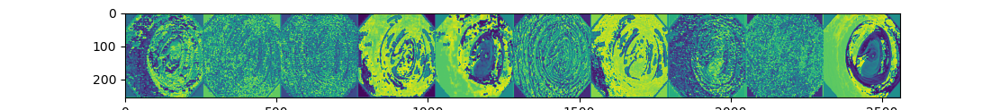
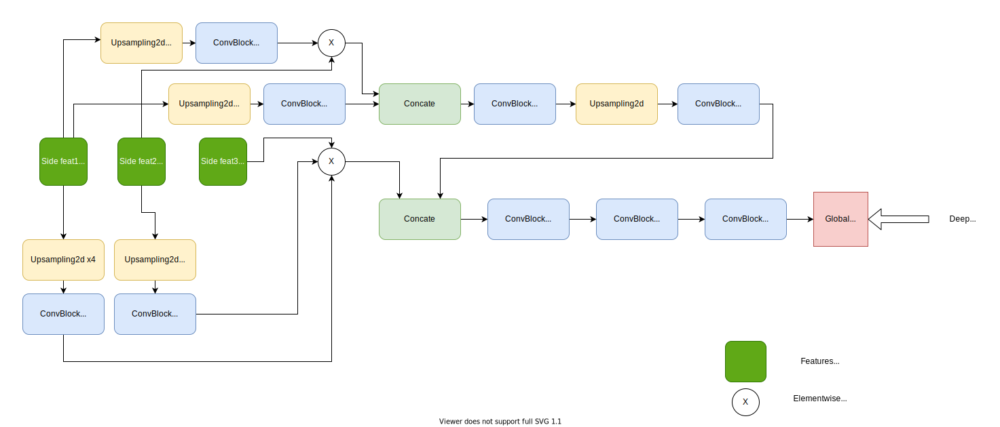

# Parallel Reverse Attention Network for Polyp Segmentation

## Paper Abstract
```
Colonoscopy is an effective technique for detecting colorectal
polyps, which are highly related to colorectal cancer. In clinical practice,
segmenting polyps from colonoscopy images is of great importance since
it provides valuable information for diagnosis and surgery. However, 
accurate polyp segmentation is a challenging task, for two major reasons:
(i) the same type of polyps has a diversity of size, color and texture; and
(ii) the boundary between a polyp and its surrounding mucosa is not
sharp. To address these challenges, we propose a parallel reverse attention
network (PraNet)for accurate polyp segmentation in colonoscopy
images. Specifically, we first aggregate the features in high-level layers
using a parallel partial decoder (PPD). Based on the combined feature,
we then generate a global map as the initial guidance area for the following components. 
In addition, we mine the boundary cues using the reverse attention (RA) module,
which is able to establish the relationship between areas and boundary cues. 
Thanks to the recurrent cooperation mechanism between areas and boundaries,
our PraNet is capable of calibrating some misaligned predictions, improving the segmentation
accuracy. Quantitative and qualitative evaluations on five challenging
datasets across six metrics show that our PraNet improves the segmentation accuracy significantly,
and presents a number of advantages in terms of generalizability, and real-time segmentation efficiency
```
:scroll: Paper link: [Parallel Reverse Attention network for Polyps Segmentation](https://arxiv.org/pdf/2006.11392v4.pdf)

## Proposed Architecture in paper

The original paper is implemented in [Pytorch](https://pytorch.org/). Here I re-implemented same paper in [Tensorflow==2.6.0](https://www.tensorflow.org/api_docs/python/tf)

### PraNet(Parallel Reverse Attention Network) consist of three main component
* Feature Extractor Backbone (here [resnet50](https://arxiv.org/pdf/1512.03385.pdf) and [Mobilenetv2](https://arxiv.org/pdf/1801.04381.pdf))
* Parellel Partial Decoder Block (Main proposal of this paper)
* Reverse Attention Block ([Reverse Attention for Salient object detection](https://arxiv.org/pdf/1807.09940.pdf))


*Proposed Architecture in paper(Image taken from paper)*

### Feature Extractor Backbone
For extracting high level features from a pretrained network, the authors of the paper has used [Res2Net50](https://arxiv.org/pdf/1904.01169.pdf) pretrained on [Imagenet](https://www.image-net.org/). A feature extractor backbone can be any SOTA pretrained Image Recognition model. I used [resnet50](https://arxiv.org/pdf/1512.03385.pdf) for high precision output and [Mobilenetv2](https://arxiv.org/pdf/1801.04381.pdf) for low latency output pretrained on [Imagenet](https://www.image-net.org/).
The ultimate goal of using a pre-trained feature extractor backbone is to extract high level features from images (<i>e.i for resnet50 {conv3_block4_out f=512, conv4_block6_out f=1024, conv5_block3_out f=2048 }</i>) and aggregate to get a global saliency map.


*Features at conv2_block3_out of resnet50 backbone*

### Parallel Partial Decoder
Most of all popular Biomedical Image Segmention model <i>like [Unet](https://arxiv.org/pdf/1505.04597.pdf) , [U-net++](https://arxiv.org/pdf/1807.10165.pdf), [ResUnet](https://arxiv.org/pdf/1904.00592.pdf) etc</i>. are full Encoder-Decoder model which aggregates all multi-level feature from backbone network. But According to [Wu et al.](https://arxiv.org/pdf/1904.08739v1.pdf) paper, <b>compared with high-level features of backbone, low-level features demand more computational resources due to their larger spatial resolutions, but contribute less to over all performance of the model.</b> Therefore, this paper introduces a PPD(Paraller Partial Decoder) block which aggregates only high-level features which is extracted from pretrained resnet50 model. This block aggregates all high-level features with parallel connection this way the gradients can flow much faster and efficiently.


*PPD block*


## Dataset source
* [Kvasir SEG dataset](https://datasets.simula.no/kvasir-seg/)

# citation
Paper
```
@article{fan2020pra,
title={PraNet: Parallel Reverse Attention Network for Polyp Segmentation},
author={Fan, Deng-Ping and Ji, Ge-Peng and Zhou, Tao and Chen, Geng and Fu, Huazhu and Shen, Jianbing and Shao, Ling},
journal={MICCAI},
year={2020}
}
```

Datset
```
@inproceedings{jha2020kvasir,
title={Kvasir-seg: A segmented polyp dataset},
author={Jha, Debesh and Smedsrud, Pia H and Riegler, Michael A and Halvorsen, P{\aa}l and
de Lange, Thomas and Johansen, Dag and Johansen, H{\aa}vard D},
booktitle={International Conference on Multimedia Modeling},
pages={451--462},
year={2020},
organization={Springer}
}
```
